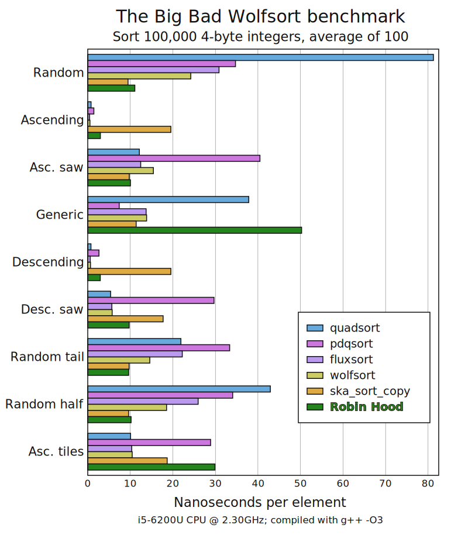

# Robin Hood Sort: the algorithm for uniform data

Robin Hood Sort is a stable integer sorting algorithm that achieves performance several times better than the state of the art on uniformly random arrays, with worst-case performance similar to a hybrid merge sort.

    Best        Average     Worst       Memory      Stable      Deterministic
    n           n           n log n     n           Yes         Yes

The version given here is not well-tested, is only written for 4-byte integers, and will definitely fail on arrays containing the maximum possible integer. Please don't use it directly. The main purpose of this repository is to show the radix sort people that a great benchmark on random data doesn't mean much. The main purpose of Robin Hood sort is to be used as a possible base case in quicksort algorithms like fluxsort and pdqsort, in order to take advantage of ranges where a uniform distribution seems likely and beat those radix sorts once and for all.

Compared below are merge sort [quadsort](https://github.com/scandum/quadsort), top-of-the-line hybrid quicksorts [pdqsort](https://github.com/orlp/pdqsort) and [fluxsort](https://github.com/scandum/fluxsort), and radix sorts [wolfsort](https://github.com/scandum/wolfsort) (also a bit of a hybrid) and [ska_sort](https://probablydance.com/2017/01/17/faster-sorting-algorithm-part-2/). If you're wondering, Timsort is no good with integer arrays like this, and single-core IPS⁴o loses to the quicksorts on random data. Run on your machine with `$ ./wolfbench.sh` to download the sorts and build, then `$ ./runwolfbench` to perform the benchmark.

So Robin Hood is tested against the fastest sorting algorithms I know, on wolfsort's own benchmark suite. On the headline benchmark, there's no contest! Surprised? Well, Robin Hood is very skilled—don't forget it—but his greatest skill is cheating.

*Don't worry too much about the bad cases, unless of course you want to use RH on its own, which you shouldn't. Flux/wolfsort have a special analysis pass to use quadsort for most of these, and "generic order" uses a small range, which can easily be detected and obliterated by counting sort. "ascending tiles" hints at a more significant problem, which is that the range can be split into several small clusters. When hybridized with quicksort, it should mostly be possible to rule these cases out during median selection, and quicksort partitioning naturally splits off clusters, which could then be passed to RH.*

### Algorithm

The main idea of Robin Hood Sort is to allocate a buffer a few times larger than the array to be sorted, then send each entry to the appropriate position in the buffer for its value (to get this position, subtract the minimum value, then bitshift). If there's no room in that spot, move entries forward to find space for it, keeping everything in sorted order (that is, place the new entry after any smaller or equal ones, shifting larger ones forward by 1 to make room). Afterwards, the entries are put back in the list with branchless filtering to remove the gaps. The algorithm is named for [Robin Hood hashing](https://programming.guide/robin-hood-hashing.html), which does exactly the same thing to find space for hashes within a hash table. In fact, as Paul Khuong [writes](https://pvk.ca/Blog/2019/09/29/a-couple-of-probabilistic-worst-case-bounds-for-robin-hood-linear-probing/), "I like to think of Robin Hood hash tables with linear probing as arrays sorted on uniformly distributed keys, with gaps". The name for RH hashing comes from the idea that those shifted entries are "rich" because they got there first, and the new entry gets to rob a space from them. I don't think this is the best metaphor, [as I explained](https://youtu.be/paxIkKBzqBU?t=1340) in a talk on searching.

Robin Hood hashing works on the assumption the hashes are uniformly distributed. But the real Robin Hood doesn't live in some kind of communist utopia. Robin Hood Sort works even in non-ideal conditions. The strategy is that when an area gets particularly rich in array values, some of them are scooped up and moved back to the beginning of the original array, which we're not using any more. These stolen values will later be merged—hey, you know, this is much more like Robin Hood than that other part. Let's pretend this is where the name comes from. Anyway, once all the entries from the original array have been placed, the remaining ones from the buffer are moved back, after the stolen ones. Then the stolen values are merged (as in merge sort) with each other, and one last merge with the remaining values completes the sort.

Stealing happens after a value is inserted to the buffer. It's triggered based on the number of positions touched, starting at the target position and ending at the last value pushed out of the way. The simplest form is to move the entire chain. This starts at the first nonempty value, possibly before the target position, to avoid moving a value before one that's equal to it and breaking stability (besides, stealing more values is faster overall). But a modification speeds things up: round down to the nearest multiple of a configurable block size, which is a power of two. Then because every block is sorted, the first few passes of merge sorting on stolen values can be skipped. Since chains in the buffer are constructed by a process that's basically like insertion sort, we should expect overall performance in the worst case to resemble a hybrid merge sort, where smaller merges are skipped in favor of insertion sort. Here, the block size is set to 16. The initial threshold for stealing is twice the block size, because merging any number of stolen values with the rest of the array is costly, and it's reduced to the block size the first time any values are stolen.
