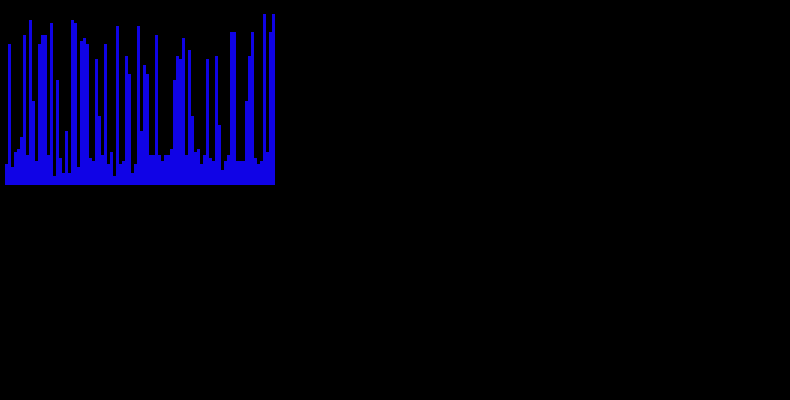
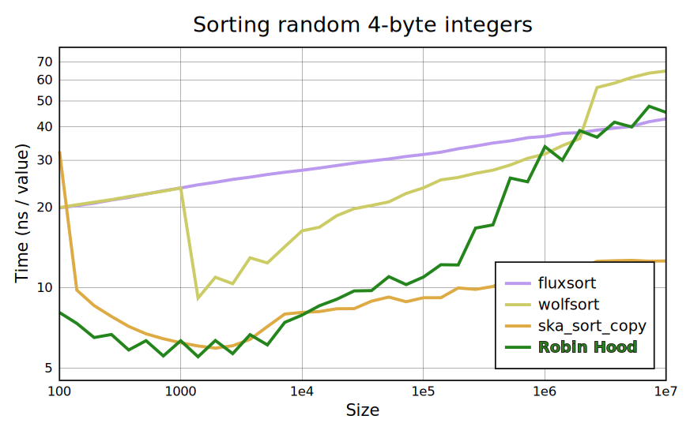
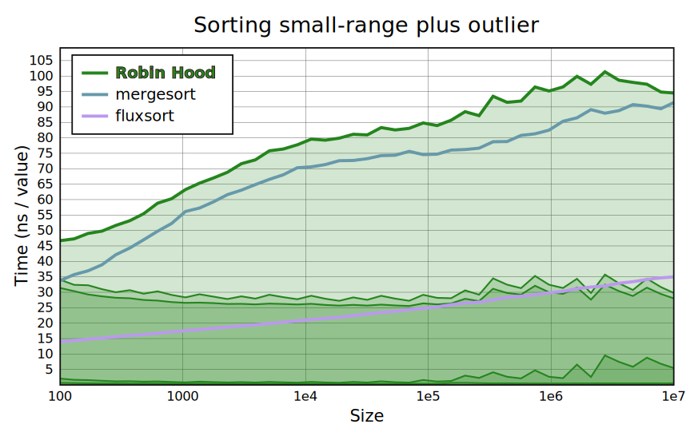
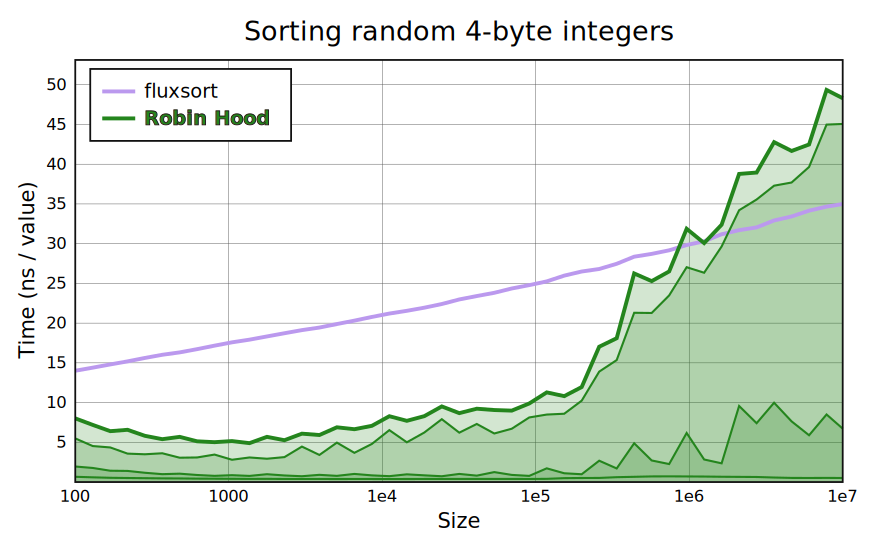
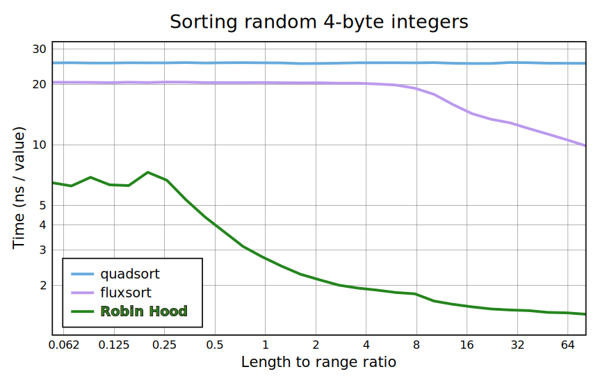
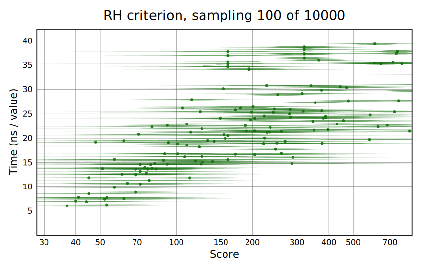
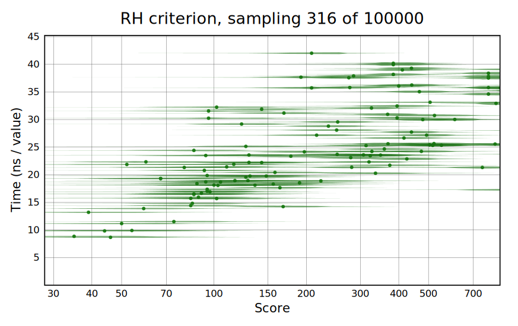

# Robin Hood Sort: the algorithm for uniform data

Robin Hood Sort is a stable numeric sorting algorithm that achieves performance several times better than the fastest comparison sorts on uniformly random arrays, with worst-case performance similar to an unimpressive hybrid merge sort. It's in a similar category to counting sort and radix sort (and [switches](#counting-sort) to counting sort on small ranges), but works on any range unlike counting sort, and can be better than radix sort for large element sizes or small arrays.

    Best     Average        Worst       Memory      Stable      Deterministic
    n        n log log n    n log n     n           Yes         Yes

While this repository is only for demonstration and testing purposes, it appears that RH sort is of significant practical use. Poorly performing cases can be [detected](#statistical-detection) with good probability from a random sample of `√n` values—that's an exact, not asymptotic, count—selected from an array of length `n` and then sorted. This test is integrated into pivot selection as part of [distribution crumsort](https://github.com/mlochbaum/distcrum) (a high-performance quicksort), allowing RH to be used as an alternate base case.



Compared below are merge sort [quadsort](https://github.com/scandum/quadsort), top-of-the-line hybrid quicksorts [pdqsort](https://github.com/orlp/pdqsort) and [fluxsort](https://github.com/scandum/fluxsort), and radix sorts [wolfsort](https://github.com/scandum/wolfsort) (also a bit of a hybrid) and [ska_sort_copy](https://probablydance.com/2016/12/02/investigating-radix-sort/) (note that most benchmarks elsewhere are based on the slower in-place [ska_sort](https://probablydance.com/2017/01/17/faster-sorting-algorithm-part-2/)). If you're wondering, Timsort is no good with integer arrays like this, and single-core IPS⁴o loses to the quicksorts on random data.


<details><summary><b>details</b></summary>

```sh
# To download other sorts and build
./wolfbench.sh
# Perform the benchmark; save results
./runwolfbench > res/wolf.txt
# Make chart (requires BQN)
images/bar.bqn res/wolf.txt > images/wolf.svg
```

</details>

So Robin Hood is tested against the fastest sorting algorithms I know, on wolfsort's own benchmark suite. And ska_sort_copy is the only real contender (has the sheep exchanged clothing with the wolf?). Comparison sorts never stood a chance! Robin Hood is very skilled—don't forget it—but his greatest skill is cheating.

The method is based on daring optimism: allocate more than enough space for all values, then simply try to place each one where it ought to go, numerically speaking ([details below](#algorithm)). If there's no room… then Robin Hood must rely on trickery. First, here's how it scales on random data.


<details><summary><b>details</b></summary>

```sh
# Perform the benchmarks; save results
gcc -O3             -D NOTEST bench.c && ./a.out l > res/r_rh.txt
gcc -O3 -D FLUXSORT -D NOTEST bench.c && ./a.out l > res/r_flux.txt
gcc -O3 -D WOLFSORT -D NOTEST bench.c && ./a.out l > res/r_wolf.txt
g++ -w -fpermissive -O3 -D SKACOPY -D NOTEST bench.c && ./a.out l > res/r_ska_.txt

# Make chart (requires BQN)
images/line.bqn res/r_{flux,wolf,ska_,rh}.txt > images/rand.svg
```

</details>

Robin Hood is without equal under length 100,000 for this good—but not best—case. Beyond that the picture is not so nice because of the large buffer and scattershot approach in filling it. My L2 cache fits 128k 4-byte integers, and there's a clear increase as it's overwhelmed. But for the intended use this is no concern: fluxsort (like any quicksort) works by splitting the array in half, and sorting recursively. Switching to Robin Hood at the appropriate length would make an overall algorithm with fluxsort's very clean cache usage, and reduce the required buffer size as well. Imagine cutting off the right side of the fluxsort graph to affix it to Robin Hood's line lower down. The Quad Merge Robin [variant](#variations) does this with quadsort, and my [distribution crumsort](https://github.com/mlochbaum/distcrum) includes code to shuffle pivots around (not stable) to keep track of the range of subarrays with just a quick initial pass, then a few swaps per partition.

As you might guess, "Asc. tiles" from the bar chart hints at a significant problem: the range can be clumpy instead of uniform. Here's my best guess at a worst case for RH sort: one very large element followed by many random small ones.


<details><summary><b>details</b></summary>

```sh
# Do benchmark
gcc -O3 -D WORST -D PROFILE -D NOTEST bench.c && ./a.out l > res/sp_rh.txt
gcc -O3 -D WORST -D MERGESORT -D NOTEST bench.c && ./a.out l > res/s_merge.txt
# For comparison: don't use worst case because in flux it's better
gcc -O3 -D QUADSORT -D NOTEST bench.c && ./a.out l > res/s_quad.txt
gcc -O3 -D FLUXSORT -D NOTEST bench.c && ./a.out l > res/r_flux.txt
# Make image
images/line.bqn res/{sp_rh,s_merge,s_quad,r_flux}.txt > images/bad.svg
```

</details>

All these small elements get sent to the same index (with maybe a slight difference for very large arrays). But the Robin Hood algorithm has a mechanism to rescue them from the buffer, 16 values at a time. These values are then merge sorted. The buffer insertion amounts to an insertion sort on these blocks of 16, which is why it can be said that RH degrades to a bad hybrid merge sort.

The RH graph here is split into a few parts. The large ones are insertion near the bottom and merging at the top. Also shown is a pure merge sort based on the same merging code. This merging code is not fast (for now at least), but if you've downloaded quadsort using `./wolfbench.sh`, you can build with `-D QUADMERGE` to use it instead (see [variations](#variations)). Then it comes within about 10ns/value of quadsort—the 20ns/v of insertion work pays for itself and then some relative to the poorly optimized merge sort, but is only worth about 10ns/v of quadsort time.

Horrible cases like this are easily detectable in a quicksort during median selection. Figuring out how bad it can get without being detectable from a sample will require some more benchmarks and statistics.

## Algorithm

The main idea of Robin Hood Sort is to allocate a buffer a few times (2.5 or more) larger than the array to be sorted, then send each entry to the appropriate position in the buffer for its value. To get this position, subtract the minimum value, then bitshift, with the shift amount chosen based on the range. If there's no room in that spot, move entries forward to find space for it, keeping everything in sorted order (that is, place the new entry after any smaller or equal ones, shifting larger ones forward by 1 to make room). Afterwards, the entries are put back in the list with branchless filtering to remove the gaps. The algorithm is named for [Robin Hood hashing](https://programming.guide/robin-hood-hashing.html), which does exactly the same thing to find space for hashes within a hash table. In fact, as Paul Khuong [writes](https://pvk.ca/Blog/2019/09/29/a-couple-of-probabilistic-worst-case-bounds-for-robin-hood-linear-probing/), "I like to think of Robin Hood hash tables with linear probing as arrays sorted on uniformly distributed keys, with gaps". The name for RH hashing comes from the idea that those shifted entries are "rich" because they got there first, and the new entry gets to rob a space from them. I don't think this is the best metaphor, [as I explained](https://youtu.be/paxIkKBzqBU?t=1340) in a talk on searching.

Robin Hood hashing works on the assumption the hashes are uniformly distributed, but the real Robin Hood doesn't live in some kind of communist utopia. Robin Hood Sort works even in non-ideal conditions. The strategy is that when an area gets particularly rich in array values, some of them are scooped up and moved back to the beginning of the original array, which we're not using any more. These stolen values will later be merged—hey, you know, this is much more like Robin Hood than that other part. Let's pretend this is where the name comes from. Anyway, once all the entries from the original array have been placed, the remaining ones from the buffer are moved back, after the stolen ones. Then the stolen values are merged (as in merge sort) with each other, and one last merge with the remaining values completes the sort.

Stealing happens after a value is inserted to the buffer. It's triggered based on the number of positions touched, starting at the target position and ending at the last value pushed out of the way. The simplest form is to move the entire chain. This starts at the first nonempty value, possibly before the target position, to avoid moving a value before one that's equal to it and breaking stability (besides, stealing more values tends to be faster overall). But a modification speeds things up: round down to the nearest multiple of a configurable block size, which is a power of two. Then because every block is sorted, the first few passes of merge sorting on stolen values can be skipped. Since chains in the buffer are constructed by a process that's basically insertion sort, we should expect overall performance in the worst case to resemble a hybrid merge sort, where smaller merges are skipped in favor of insertion sort. Here, the block size is set to 16. The initial threshold for stealing is twice the block size, because merging any number of stolen values with the rest of the array is costly, and it's reduced to the block size the first time any values are stolen.


<details><summary><b>details</b></summary>

```sh
# Do benchmark
gcc -O3 -D PROFILE -D NOTEST bench.c && ./a.out l > res/rp_rh.txt
# For comparison
gcc -O3 -D FLUXSORT -D NOTEST bench.c && ./a.out l > res/r_flux.txt
# Make image
images/line.bqn res/r{_flux,p_rh}.txt > images/parts.svg
```

</details>

Time taken in each section: from bottom to top, range-finding, buffer initialization, insertion, and filtering. Merging is rare for random data and doesn't appear on this graph.

## Analysis

Here we'll show that Robin Hood Sort can achieve O(n log log n) *average* time on random arrays with range at least twice the length (for smaller ranges, use counting/bucket sort and get guaranteed O(n) time), and O(n log(n)) worst-case time. And that it's stable. For practical purposes, that average time is effectively linear. Unfortunately, for practical purposes it's also not achieved: these times are based on the typical random-access model where reading or writing any value in memory takes constant time. Real-world random access scales more like `√n` as various levels of cache get exhausted, and this causes RH sort to lose ground against quicksorts as `n` increases, instead of gaining as theory would suggest.

Here are the steps we need to consider:
* Find the minimum and maximum
* Initialize the buffer
* Insert to the buffer
* Move/filter elements back from the buffer
* Merge sort stolen blocks
* Final merge

In fact, every step of this except the merge sort is O(n). This is obvious for the range-finding and final merge, as they're done in one pass. Same for initializing and filtering the buffer, provided the length of the buffer is O(n). But it's at most `5*n` by construction, so that's handled. The only parts left are the buffer insertion, and that merge sort.

It's not obvious, but buffer insertion is kept to O(n b) by the block-stealing mechanism. When a value is inserted, it could touch any number of positions in the buffer. But if this number is greater than some fixed threshold `b`, some values will be removed. Let's split the cost into two parts: cost pertaining to values that stay, and to values that are then stolen. Less than `b` values can stay on each insertion, so this portion of the cost is under `n*b` entries. And each value can be removed only once, so the total cost pertaining to removed values is proportional to `n`. The sum of the two parts is then proportional to `n*b`. Even with a variable `b` as discussed below, it's less than log(n) and doesn't affect the O(n log(n)) worst case.

Merge sort has a well known worst case bound of O(n log n). This is where most of our cost comes from: in the worst case, nearly all values are snatched from the buffer and the cost reaches that bound. However, the expectation for uniform distributions is different: very few blocks should be stolen. To figure out what exactly the consequences are, we need to know something about the statistics of Robin Hood hashing.

### Average case

The `n log log n` bound on average time requires setting a variable block size. But the size scales with `log log n`, that is, it hardly scales at all. And it's silly to apply RH sort to very large random arrays because the cache patterns are horrible. So I'm sticking with a fixed block size in the actual implementation.

From lemma 5.4 [here](http://opendatastructures.org/ods-python/5_2_LinearHashTable_Linear_.html), the probability that a chain of length `k` starts at any particular position is at most `cᵏ`, for a constant `c` that depends on the load factor and is less than 1 for a half-full table (specifically, `α*exp(α)` for load factor `α`). A random position hits such a chain with probability proportional to its length, so that the total expected number of elements moved on one insertion is `b²*c^b` (we also need to consider chains longer than `b`, but these only contribute a constant factor). Setting `b = -2*log_c(log₂(n))`, which is positive since `c<1`, `c^b` is `1/log²(n)`, giving a theft-per-insertion expectation of `b²/log²n < 1/log n`. Now the total asymptotic cost is the cost of insertions plus the cost of merge sorting those blocks:

    cost < n*b + (n/log n)log(n/log n)
         < n*b + (n/log n)log(n)
         = n*b + n

The total time is now proportional to `n log log n`.

### Stability

Sorting stability means that two equal values in the initial array maintain their order in the sorted array, that is, a value with a lower index isn't swapped with an equal value with a higher index. For the function `rhsort32` implemented here, it's meaningless: an integer can't remember where it came from. However, stability can be important when sorting one array of keys according to another array of values. Robin Hood Sort could probably be adapted to this use case, so it's nice that it's stable without any significant performance cost.

During buffer insertion, the values in the buffer have lower indices than those yet to be inserted. So an inserted value needs to be placed after any equal values it encounters. No problem.

Stolen values are placed at the beginning of the array, which doesn't reorder them with respect to an uninserted values but could break ordering with respect to the buffer. Equal values are always adjacent in the buffer, so we just need to be sure Robin Hood doesn't grab a trailing component of a group of equal values. The fix is to walk back to the beginning of the chain (or at least the previous unequal value, but this benchmarks worse) before stealing.

After insertion, filtering is obviously stable, and merging is well known to be stable.

Since stability's meaningless for pure numeric sorting, `rhsort32` does include some non-stable optimizations. First, it uses counting sort for small ranges, which must be changed to bucket sort, that is, it should actually move values from the initial array instead of just reconstructing them from counts. Second, it uses the array's maximum for an "empty space" sentinel value in the buffer, and infers that any missing elements after filtering were equal to it. For a sort-by operation, it should be modified to one plus the maximum: it's fine if this overflows, but the full-range case where both minimum and maximum possible values are present has to be excluded somehow.

## Variations

The following options can be applied when compiling rhsort.c:

- Brave Robin (`-D BRAVE`) disables block stealing, leading to O(n) average case performance (like hash table insertion) and O(n²) worst case. It needs to allocate and initialize more memory because overflows can be longer, leading to slower actual performance except at small sizes.
- Quad Robin (`-D QUADMERGE`) uses quadsort's methods for merging stolen blocks together, making the worst case significantly better, only 10 to 20ns/value worse than quadsort.
- Merge Robin (function `rhmergesort32`) is an O(n log(n)) merge sort hybrid that uses Robin Hood sort for sizes below 2<sup>16</sup>, then merges these units together. It's faster for large arrays, but only if `QUADMERGE` is also used.

## Counting sort

Because it relies on shifting values right to fit the range into the buffer, Robin Hood Sort begins to degrade when the range gets smaller than the buffer should be. This could be fixed with another loop that shifts left, but these ranges are a natural fit for counting sort, so it switches to that instead. To write the values out after counting, a normal loop is used for high densities, while a strategy based on prefix sums is used for lower ones (it can be sped up [with SIMD instructions](https://en.algorithmica.org/hpc/algorithms/prefix/), but I haven't found a way to generate code like this without compiler intrinsics).


<details><summary><b>details</b></summary>

```
gcc -D RANGES             -O3 bench.c && ./a.out l 32 > res/c_rh.txt
gcc -D RANGES -D FLUXSORT -O3 bench.c && ./a.out l 32 > res/c_flux.txt
gcc -D RANGES -D QUADSORT -O3 bench.c && ./a.out l 32 > res/c_quad.txt

# Make image
images/line.bqn res/c_{quad,flux,rh}.txt > images/range.svg
```

</details>

## Statistical detection

When Robin Hood performs poorly, the root cause is too many buffer collisions, that is to say, too many values that are close to each other in the buffer. But if that's the case, it should show in a random sample of enough values from the array. As it turns out, a sample of size `√n` is enough, because each of the roughly `n/2` *pairs* of values can be tested. The metric, or score, used considers the block size of 16 to be the threshold for a pair to count as a collision. If the distance `d` between a pair of samples is less than that, then it counts for `16-d` points in the score. The sum over all pairs can be computed efficiently by sorting the sample, then scanning over it (this would get slow with many samples close to each other, except that we can exit early if the total exceeds the maximum allowed). Because the score can only increase as more samples are added, an option is to start with a smaller number of samples but add more if collisions aren't found, keeping the sampling cost low on poor distributions with some extra sample-merging overhead for larger ones.

In the following tests, piecewise-linear distributions are generated using a strategy that allows for large dense regions and gaps. On each distribution, a single average sorting time is measured, and many samples are taken to find a distribution of scores. The test is done with quadsort's merge (Quad Robin) because that's most relevant to practical application. The uniform cases at the very bottom of the graphs are reasonably well separated from the ones that do worse than fluxsort. A score threshold between 70 and 100 is sufficient to accept the good cases while keeping the chance of slowdown on a bad array small.


<details><summary><b>details</b></summary>

```
gcc -D QUADMERGE -D NOTEST -O3 crit.c && ./a.out > res/crit.txt
images/scatter.bqn res/crit.txt > images/crit.svg
```

</details>


<details><summary><b>details</b></summary>

```
gcc -D LENGTH=100000 -D QUADMERGE -D NOTEST -O3 crit.c && ./a.out > res/crit5.txt
images/scatter.bqn res/crit5.txt > images/crit5.svg
```

</details>

## History

Robin Hood hashing is fairly well known to algorithms enthusiasts. I encountered it in 2017 or 2018 when working on search algorithms for Dyalog APL, and later presented a SIMD-oriented version in [a talk](https://youtu.be/paxIkKBzqBU) ([zipped slides](https://www.dyalog.com/user-meetings/uploads/conference/dyalog18/presentations/D08_Searches_Using_Vector_Instructions.zip)) on the algorithms eventually released in Dyalog 18.0. This implementation features the idea of dropping entries with too great of an offset from the hash table in order to protect against inputs engineered to defeat the hash. It guarantees linear insertion performance because the maximum offset is also the greatest number of times an element can be touched during insertion. But for sorting it would require storing or recomputing the offset, and the degradation with non-uniform inputs is much worse.

What I now call Brave Robin sort was originally used in a method of generating simple random samples in 2021: see the algorithm for `Subset` with Floyd's method [here](https://mlochbaum.github.io/BQN/implementation/primitive/random.html#simple-random-sample). [Dzaima](https://github.com/dzaima) and I developed the Knuth version when [Elias Mårtenson](https://github.com/lokedhs) asked about generating samples in his array language KAP—dzaima remarked that "the hashmap doesn't really need to hash, as the keys are already guaranteed random". The next day I hit on the idea of using a bitshift as an order-preserving hash and the Robin Hood insertion strategy to build a "sorted not-hash" table, resulting in [this implementation](https://github.com/dzaima/CBQN/pull/1).

I'd also done a fair bit of research on sorting by this time. I'd made some improvements to pdqsort at Dyalog, mostly described in my [sorting notes](https://mlochbaum.github.io/BQN/implementation/primitive/sort.html), and more recently had [worked](https://github.com/scandum/fluxsort/issues/1) with [scandum](https://github.com/scandum) on some details of fluxsort. So I found the random subset algorithm interesting as a specialized sorting algorithm, but the possibility of an O(n²) bad case seemed too dangerous. Eventually I considered trying to improve this worst case, and figured out the block-stealing mechanism within a day or two. Seemed very promising; I wrote the code and started benchmarking pretty much immediately.
